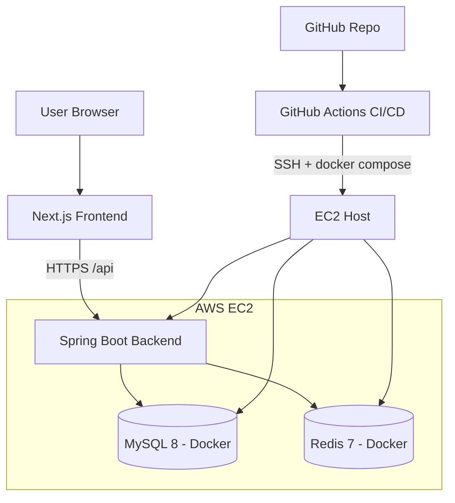

# ClassHub

학원 강사들이 수업·학생·조교 업무를 한 곳에서 관리하고 원활하게 소통할 수 있도록 돕는 플랫폼입니다. 본 문서는 프로젝트 개요와 현재까지 합의된 코드 규칙, 문서 구조를 한눈에 보여주는 페이지이며, 개발 진행에 따라 지속적으로 갱신됩니다.

## 프로젝트 개요

- 목표: 강사 업무(반/세션/학생/조교/공지/근무기록/초대)를 통합 관리하고, 효율적인 커뮤니케이션을 제공
- 아키텍처: Next.js 프런트엔드 ↔ Spring Boot 백엔드 ↔ MySQL/Redis (Docker), 배포는 GitHub Actions + AWS EC2
- 주요 문서: `docs/spec/v1.2.md` (테크스펙), `docs/todo/v1.3.md` (TODO), `docs/plan/*_plan.md` (설계), `docs/standards/*.md`(코드 규칙), `docs/history/AGENT_LOG.md`(히스토리)

## 기술 스택

- Frontend: Next.js 16, React 19, TypeScript 5, Tailwind CSS 4
- Backend: Spring Boot 4.0.0, Java 21, Gradle 8, Spring Data JPA/Hibernate, Spring Security, JWT, SpringDoc OpenAPI, Testcontainers
- Infra: Docker/Compose, GitHub Actions, AWS EC2, Nginx Proxy Manager

## 현재 상태 요약

- TODO: `docs/todo/v1.0.md`에서 Phase/EPIC/Task 단위로 관리
- 진행 규칙: “go” 지시 시 TODO 문서 순서대로(진행중(🔄) 우선, 없으면 첫 대기(⚪)) 처리
- 설계 절차: 각 Task마다 `docs/plan/<feature>_plan.md` 작성 → 한국어 요약 제공 → 승인 후 구현(TDD)
- 히스토리: 의미 있는 이벤트(STRUCTURAL/BEHAVIORAL/DESIGN/TODO_UPDATE/BUGFIX/RELEASE) 발생 시 `docs/history/AGENT_LOG.md`에 Append
- CI: PR에서 커밋/제목을 Conventional Commits로 검증(Commitlint). MCP+GitHub 연동 가이드는 `docs/setup/mcp-github-setup.md` 참고

## 코드 규칙 요약

- 공통(BaseEntity/ID/Auditing/응답)
  - 모든 엔티티는 `global.entity.BaseEntity` 상속: `UUID id`, `LocalDateTime createdAt`, `LocalDateTime modifiedAt`
  - Hibernate `@UuidGenerator`로 UUID 생성, Spring Data JPA Auditing(`@CreatedDate`, `@LastModifiedDate`)
  - DB 저장은 `BINARY(16)` 권장(공간/인덱스 효율), API에서는 문자열 UUID 노출
  - 전역 응답 포맷은 `global.response.RsData`이며 ResponseAspect가 HTTP 상태 코드를 자동 반영한다.
- 백엔드(Java + Spring)
  - 패키지 최상위는 `global`, `domain`
    - `global`: 설정/보안/에러/공통 유틸 등 횡단 관심사
    - `domain.<feature>`: 기능별로 `web | application | model | repository`
  - 서비스/트랜잭션은 `domain.<feature>.application`에서 조율, 컨트롤러/리포지토리는 얇게 유지
  - 테스트: JUnit5, MockMvc(web 슬라이스), 리포지토리/트랜잭션 통합 테스트
  - 포매팅/정적분석: Spotless + Google Java Format, 최소 Checkstyle(추가 도입은 후속)
  - 상세: `docs/standards/java-style.md`
- 프런트엔드(Next + React + TS)
  - App Router/feature-first 구조, 컴포넌트는 PascalCase, 파일은 kebab-case
  - TS strict, unknown 우선, 상태엔 구분합집합 사용, 훅은 `useXxx.ts`
  - RTL 중심의 컴포넌트/통합 테스트, ESLint + Prettier
  - 상세: `docs/standards/ts-react-style.md`

## 문서 구조

- 스펙: `docs/spec/v1.2.md`
- 설계: `docs/plan/*_plan.md` (Task 단위), 예: `dev-standards_plan.md`
- 규칙: `docs/standards/java-style.md`, `docs/standards/ts-react-style.md`, `docs/standards/commit-branch.md`
- TODO: `docs/todo/v1.3.md`
- 로그: `docs/history/AGENT_LOG.md`

## 작업 방식(요약)

- “go” → TODO 순서대로 다음 Task 선택 → `*_plan.md` 작성(+ 한국어 요약) → 승인 → TDD(레드/그린/리팩터) → 커밋은 구조/행위 분리 → AGENT_LOG 기록

## 로컬 부트스트랩 데이터

- `local`, `dev` 프로필에서 `global.init.BootstrapDataRunner`가 자동 실행되어 기본 계정/코스/학생/진도 데이터를 주입한다.
- 속성: `bootstrap.data.enabled=true`, `bootstrap.data.force=false` (필요 시 `application-local.yml`에서 제어).
- 공통 비밀번호: `Classhub!234`
- 계정
  - SuperAdmin: `admin@classhub.dev`
  - Teacher: `teacher_alpha@classhub.dev`, `teacher_beta@classhub.dev`
  - Assistant: `assistant_alpha_{1..3}@classhub.dev`, `assistant_beta_{1..3}@classhub.dev`
  - Student 계정 샘플: `student_alpha_main@classhub.dev`, `student_beta_main@classhub.dev`
- 각 Teacher는 3개의 Course와 30개의 StudentProfile을 보유하며, StudentProfile마다 PersonalLesson 3건이 생성된다.
- Invitation 시드는 Teacher→Assistant, Assistant→Student 케이스를 모두 포함하며 `STD-*/AST-*` 코드로 구분된다.

## 프런트엔드 빠른 시작

- `frontend/` 디렉터리는 Next.js 16 + React 19 + Tailwind 4 기반의 데모 앱 스캐폴딩이다.
- 실행 절차
  1. `cd frontend && npm install`
  2. `.env.local` 생성 → `NEXT_PUBLIC_API_BASE_URL` 설정 (`.env.local.example` 참고)
  3. `npx next dev --experimental-https` 로 https://localhost:3000 개발 서버 실행
- 공용 API 래퍼는 `src/lib/apiClient.ts` 에서 제공하며, TODO에 따라 Auth/Invitation/StudentProfile 화면을 단계적으로 추가한다.

## 향후 포함 예정

- 설치/실행 방법, 환경 변수, 로컬/배포 구성 예시
- API 문서(Swagger/OpenAPI) 링크
- 스크린샷/데모 시나리오

문의/기여: 이슈/PR 또는 `docs/plan`/`docs/standards`에 제안으로 남겨주세요.
