# ClassHub 전체 ERD

## 전체 엔티티 관계도

```mermaid
erDiagram
    %% ========================================
    %% 조직 구조
    %% ========================================
    COMPANY ||--o{ BRANCH : has

    %% ========================================
    %% 회원 & 역할별 정보 (1:1)
    %% ========================================
    MEMBER ||--o| TEACHER_INFO : has
    MEMBER ||--o| STUDENT_INFO : has

    %% ========================================
    %% 배정 관계 (M:N)
    %% ========================================
    MEMBER }|--o{ TEACHER_BRANCH_ASSIGNMENT : teacher
    BRANCH }|--o{ TEACHER_BRANCH_ASSIGNMENT : branch

    MEMBER }|--o{ TEACHER_ASSISTANT_ASSIGNMENT : teacher
    MEMBER }|--o{ TEACHER_ASSISTANT_ASSIGNMENT : assistant

    %% ========================================
    %% 수업 구조
    %% ========================================
    BRANCH ||--o{ COURSE : has
    MEMBER ||--o{ COURSE : teaches

    %% ========================================
    %% 학생 등록 프로세스
    %% ========================================
    MEMBER ||--o{ STUDENT_ENROLLMENT_REQUEST : requests
    COURSE ||--o{ STUDENT_ENROLLMENT_REQUEST : receives

    MEMBER }|--o{ STUDENT_COURSE_ENROLLMENT : student
    COURSE }|--o{ STUDENT_COURSE_ENROLLMENT : course

    %% ========================================
    %% 학생 기록 (반별 추가 정보)
    %% ========================================
    MEMBER ||--o{ STUDENT_COURSE_RECORD : student
    COURSE ||--o{ STUDENT_COURSE_RECORD : course
    CLINIC_SLOT ||--o{ STUDENT_COURSE_RECORD : defaultSlot

    %% ========================================
    %% 진도 관리
    %% ========================================
    COURSE ||--o{ SHARED_LESSON : has
    MEMBER ||--o{ SHARED_LESSON : writes

    STUDENT_COURSE_RECORD ||--o{ PERSONAL_LESSON : owns
    MEMBER ||--o{ PERSONAL_LESSON : writes

    %% ========================================
    %% 클리닉 구조
    %% ========================================
    MEMBER ||--o{ CLINIC_SLOT : owns
    BRANCH ||--o{ CLINIC_SLOT : locates

    CLINIC_SLOT ||--o{ CLINIC_SESSION : generates

    CLINIC_SESSION ||--o{ CLINIC_ATTENDANCE : has
    STUDENT_COURSE_RECORD ||--o{ CLINIC_ATTENDANCE : attends

    CLINIC_ATTENDANCE ||--|| CLINIC_RECORD : hasRecord
    MEMBER ||--o{ CLINIC_RECORD : writes

    %% ========================================
    %% 피드백 시스템
    %% ========================================
    MEMBER ||--o{ FEEDBACK : writes

    %% ========================================
    %% 공지사항 시스템
    %% ========================================
    MEMBER ||--o{ NOTICE : writes
    NOTICE ||--o{ NOTICE_READ : hasReads

    %% ========================================
    %% 근무 일지
    %% ========================================
    MEMBER ||--o{ WORK_LOG : writes

    %% ========================================
    %% 초대 시스템
    %% ========================================
    MEMBER ||--o{ INVITATION : sends
    BRANCH ||--o{ INVITATION : targets

    %% ========================================
    %% 엔티티 정의
    %% ========================================

    COMPANY {
        uuid id PK
        string name
        text description
        string type
        string status
        uuid creatorMemberId FK
        string rejectionReason
        boolean isActive
        datetime createdAt
        datetime updatedAt
        %% type = INDIVIDUAL,ACADEMY
        %% status = UNVERIFIED,VERIFIED,REJECTED
    }

    BRANCH {
        uuid id PK
        uuid companyId FK
        string name
        boolean isActive
        datetime createdAt
        datetime updatedAt
    }

    MEMBER {
        uuid id PK
        string email UK
        string password
        string name
        string phoneNumber
        string roles
        boolean isActive
        datetime createdAt
        datetime updatedAt
        %% roles = TEACHER,ASSISTANT,STUDENT,ADMIN,SUPER_ADMIN (List<MemberRole>)
    }

    TEACHER_INFO {
        uuid id PK
        uuid memberId FK
        string subjects
        datetime createdAt
        datetime updatedAt
        %% UNIQUE(memberId)
    }

    STUDENT_INFO {
        uuid id PK
        uuid memberId FK
        date birthDate
        string schoolName
        string grade
        string parentPhone
        datetime createdAt
        datetime updatedAt
        %% UNIQUE(memberId)
    }

    TEACHER_BRANCH_ASSIGNMENT {
        uuid id PK
        uuid teacherMemberId FK
        uuid branchId FK
        string role
        boolean isActive
        datetime createdAt
        datetime updatedAt
        %% role = OWNER,MANAGER,EMPLOYEE,FREELANCE
    }

    TEACHER_ASSISTANT_ASSIGNMENT {
        uuid id PK
        uuid teacherMemberId FK
        uuid assistantMemberId FK
        boolean isActive
        datetime createdAt
        datetime updatedAt
        %% UNIQUE(teacherMemberId, assistantMemberId) (필요시)
    }

    COURSE {
        uuid id PK
        uuid branchId FK
        uuid teacherMemberId FK
        string name
        string schedules
        boolean isActive
        datetime createdAt
        datetime updatedAt
        %% schedules = ElementCollection(CourseSchedule)
    }

    STUDENT_ENROLLMENT_REQUEST {
        uuid id PK
        uuid studentMemberId FK
        uuid courseId FK
        string status
        text message
        datetime processedAt
        datetime createdAt
        datetime updatedAt
        %% status = PENDING,APPROVED,REJECTED
    }

    STUDENT_COURSE_ENROLLMENT {
        uuid id PK
        uuid studentMemberId FK
        uuid courseId FK
        datetime enrolledAt
        datetime createdAt
        datetime updatedAt
        %% UNIQUE(studentMemberId, courseId)
    }

    STUDENT_COURSE_RECORD {
        uuid id PK
        uuid studentMemberId FK
        uuid courseId FK
        uuid defaultClinicSlotId FK
        text teacherNotes
        boolean isActive
        datetime createdAt
        datetime updatedAt
        %% UNIQUE(studentMemberId, courseId)
    }

    SHARED_LESSON {
        uuid id PK
        uuid courseId FK
        uuid writerId FK
        date date
        string title
        text content
        datetime createdAt
        datetime updatedAt
    }

    PERSONAL_LESSON {
        uuid id PK
        uuid studentCourseRecordId FK
        uuid writerId FK
        date date
        string title
        text content
        datetime createdAt
        datetime updatedAt
    }

    CLINIC_SLOT {
        uuid id PK
        uuid teacherMemberId FK
        uuid branchId FK
        string dayOfWeek
        time startTime
        time endTime
        int capacity
        boolean isActive
        datetime createdAt
        datetime updatedAt
        %% dayOfWeek = MON,TUE,WED,THU,FRI,SAT,SUN
    }

    CLINIC_SESSION {
        uuid id PK
        uuid slotId FK
        date date
        boolean isCanceled
        datetime createdAt
        datetime updatedAt
        %% UNIQUE(slotId, date)
    }

    CLINIC_ATTENDANCE {
        uuid id PK
        uuid clinicSessionId FK
        uuid studentCourseRecordId FK
        datetime createdAt
        datetime updatedAt
        %% UNIQUE(clinicSessionId, studentCourseRecordId)
    }

    CLINIC_RECORD {
        uuid id PK
        uuid clinicAttendanceId FK
        uuid writerId FK
        string title
        text content
        string homeworkProgress
        datetime createdAt
        datetime updatedAt
        %% UNIQUE(clinicAttendanceId)
    }

    FEEDBACK {
        uuid id PK
        uuid memberId FK
        text content
        string status
        datetime createdAt
        datetime updatedAt
        %% status = SUBMITTED,RESOLVED
    }

    NOTICE {
        uuid id PK
        uuid teacherMemberId FK
        string title
        text content
        datetime createdAt
        datetime updatedAt
    }

    NOTICE_READ {
        uuid id PK
        uuid noticeId FK
        uuid assistantMemberId FK
        datetime readAt
        datetime createdAt
        datetime updatedAt
        %% UNIQUE(noticeId, assistantMemberId)
    }

    WORK_LOG {
        uuid id PK
        uuid assistantMemberId FK
        date date
        time startTime
        time endTime
        decimal hours
        text memo
        datetime createdAt
        datetime updatedAt
        %% UNIQUE(assistantMemberId, date)
    }

    INVITATION {
        uuid id PK
        uuid senderId FK
        uuid branchId FK
        string targetEmail
        string inviteeRole
        string status
        string code UK
        datetime expiredAt
        int useCount
        int maxUses
        datetime createdAt
        datetime updatedAt
        %% inviteeRole = ASSISTANT
        %% status = PENDING,ACCEPTED,EXPIRED,REVOKED
    }
```

## 주요 관계 요약

### 1:1 관계

- Member ↔ TeacherInfo (memberId unique)
- Member ↔ StudentInfo (memberId unique)
- ClinicAttendance ↔ ClinicRecord (clinicAttendanceId unique)

**변경사항:**

- ❌ AssistantInfo 삭제 (추가 정보 불필요)

### 1:N 관계

- Company → Branch
- Branch → Course
- Member(TEACHER) → Course
- Course → SharedLesson (ON DELETE CASCADE)
- StudentCourseRecord → PersonalLesson
- Member(TEACHER) → ClinicSlot
- Branch → ClinicSlot
- ClinicSlot → ClinicSession
- ClinicSession → ClinicAttendance

**변경사항:**

- StudentProfile → StudentCourseRecord 네이밍 변경

### M:N 관계 (중간 테이블)

- Member(TEACHER) ↔ Branch via TeacherBranchAssignment
- Member(TEACHER) ↔ Member(ASSISTANT) via TeacherAssistantAssignment
- Member(STUDENT) ↔ Course via StudentCourseEnrollment

### 복합 관계

- StudentCourseRecord: (studentMemberId + courseId) UK
  - 학생 1명이 Course마다 별도 Record
  - PersonalLesson, ClinicAttendance는 이 Record 기준

## 인덱스 전략

### 주요 인덱스

- `member.email` (UK)
- `teacher_info.member_id` (UK)
- `student_info.member_id` (UK)
- `course.branch_id` (조회)
- `course.teacher_member_id` (조회)
- `student_course_record.(student_member_id, course_id)` (UK)
- `student_course_enrollment.(student_member_id, course_id)` (UK)
- `clinic_session.(slot_id, date)` (UK)
- `clinic_attendance.(clinic_session_id, student_course_record_id)` (UK)
- `invitation.code` (UK)

### 추가 인덱스

- `teacher_branch_assignment.teacher_member_id`
- `teacher_branch_assignment.branch_id`
- `teacher_assistant_assignment.teacher_member_id`
- `teacher_assistant_assignment.assistant_member_id`
- `student_enrollment_request.status`
- `shared_lesson.date`
- `personal_lesson.date`
- `clinic_slot.teacher_member_id`
- `clinic_slot.branch_id`

## Cascade 전략

### Hard Delete (ON DELETE CASCADE)

- SharedLesson → Course
  - 반 삭제 시 공통 진도도 함께 삭제

### Soft Delete (isActive flag)

- Company (isActive)
- Branch (isActive)
- Member (isActive)
- Course (isActive)
- StudentCourseRecord (isActive)
- ClinicSlot (isActive)
- TeacherBranchAssignment (isActive)
- TeacherAssistantAssignment (isActive)

### 실제 DELETE 허용

- PersonalLesson
- ClinicRecord
- StudentEnrollmentRequest
- ClinicAttendance
- Feedback
- Notice
- NoticeRead
- WorkLog

### 취소 플래그

- ClinicSession (isCanceled) - 삭제보다 취소 표시

## 주요 변경사항 (final-entity-spec 기준)

### 1. Member

- ✅ `phoneNumber` unique 제거 (학부모 번호 중복 가능)
- ✅ `role` → `roles` (List<MemberRole>) 확장성 고려

### 2. AssistantInfo

- ❌ 엔티티 삭제 (추가 정보 불필요)

### 3. StudentProfile → StudentCourseRecord

- ✅ 네이밍 변경 ("선생님이 관리하는 반별 학생 기록")
- ✅ `studentProfileId` → `studentCourseRecordId`

### 4. 일관성 (네이밍)

- ✅ `teacherId` → `teacherMemberId`
- ✅ `assistantId` → `assistantMemberId`
- ✅ `studentId` → `studentMemberId`

### 5. SharedLesson

- ✅ `courseId` → `course` (ManyToOne, CASCADE)

### 6. Invitation

- ✅ `inviteeRole` ASSISTANT만 (학생은 자유 가입)

## 네이밍 규칙

### 일관성 유지

- {role}MemberId 형태 통일:

  - teacherMemberId ✅
  - assistantMemberId ✅
  - studentMemberId ✅

- 엔티티 참조는 명확히:
  - UUID FK: `{entity}Id`
  - ManyToOne: `{entity}` (소문자 시작)

### 테이블명

- Snake case 사용
- 엔티티명을 snake_case로 변환
  - StudentCourseRecord → student_course_record
  - TeacherBranchAssignment → teacher_branch_assignment
  - StudentCourseEnrollment → student_course_enrollment
