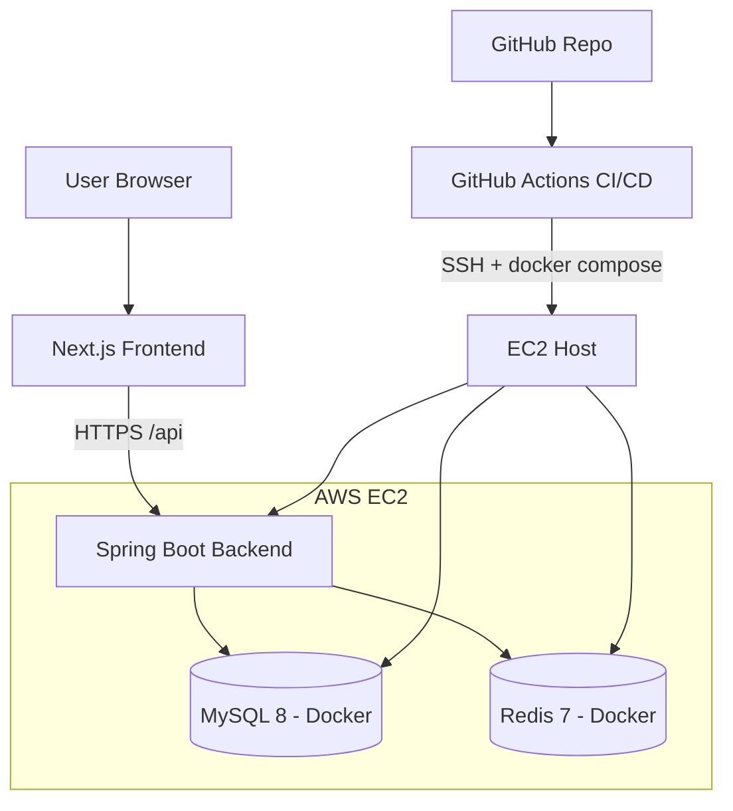
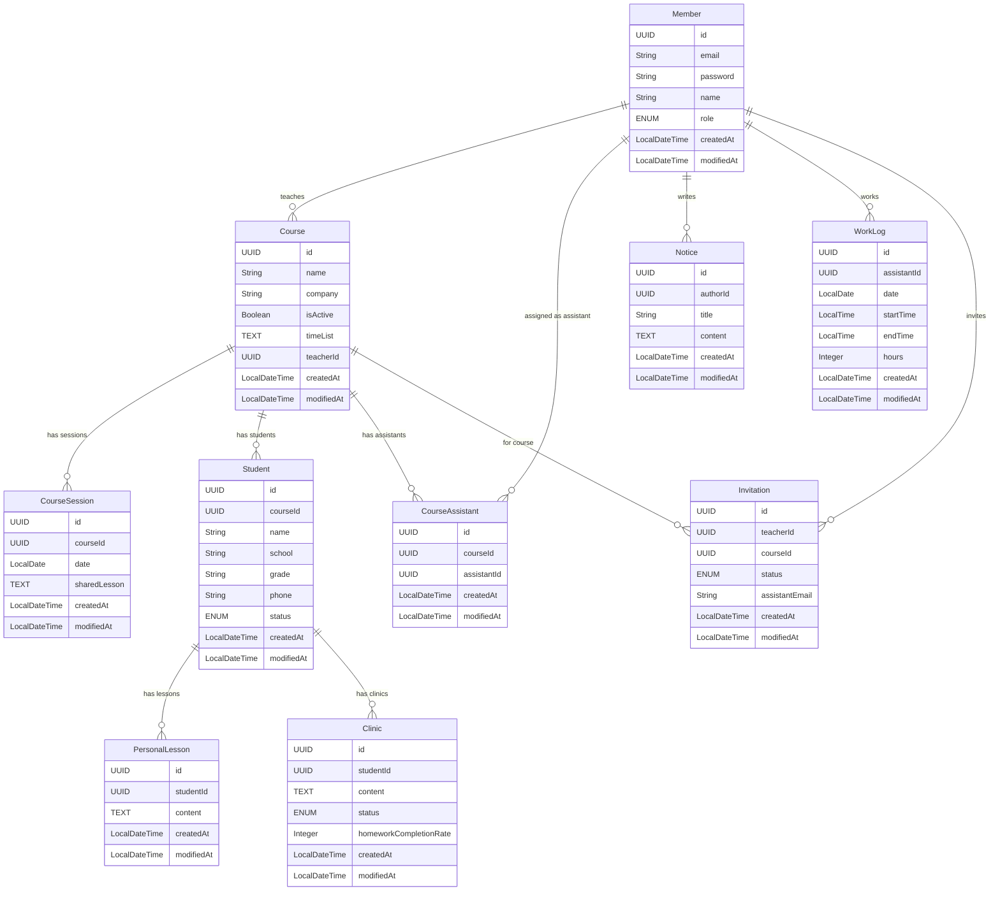

# 1. 프로젝트 개요

## 1.1 목표

- 학원 강사들이 수업·학생·조교 일정을 통합 관리하고, 원활한 커뮤니케이션과 기록 관리를 수행할 수 있는 플랫폼 구축

## 1.2 아키텍처



1. 사용자가 Frontend(Next.js)에 로그인한다.
2. JWT 토큰을 발급받아 Header에 포함해 API 요청을 보낸다.
3. Spring Boot Backend가 Role 기반 인가 후 요청을 처리한다.
4. JPA를 통해 MySQL/Redis에 접근한다.
5. 필요 시 캐시 데이터를 반환해 성능을 최적화한다.
6. Frontend가 결과를 대시보드 형태로 렌더링한다.

---

# 2. 도메인 구체화

## 2.1 주요 엔티티

| 엔티티             | 설명                                  |
| ------------------ | ------------------------------------- |
| **Member**         | 사용자 인증/인가 및 다양한 활동 주체 |
| **Student**        | 학생                                  |
| Course             | 반 정보                               |
| CourseSession      | 수업 세션                             |
| **PersonalLesson** | 개별 진도                             |
| **Clinic**         | 클리닉 내용                           |
| **Notice**         | 공지사항                              |
| **WorkLog**        | 조교 근무 시간                        |
| **Invitation**     | 조교 초대 및 승인 관리                |

## 2.2 관계

| 관계                                      | 설명                        |
| ----------------------------------------- | --------------------------- |
| Teacher 1:N Course                        | 선생님은 여러 반을 관리     |
| Teacher 1:N Notice                        | 조교 대상 공지 작성         |
| Teacher 1:N Invitation                    | 조교 초대 생성               |
| Course 1:N CourseSession                  | 반마다 여러 세션이 존재     |
| Course 1:N Student                        | 반마다 여러 학생 배정       |
| Course N:M Assistant (CourseAssistant)    | 반-조교 다대다              |
| Student 1:N PersonalLesson                | 학생별 개별 진도 기록       |
| Student 1:N Clinic                        | 학생별 클리닉 기록          |
| Assistant 1:N WorkLog                     | 조교 근무 기록              |

## 2.3 도메인 동작 규칙

1. **CourseSession 생성**: Teacher가 수업 내용을 기록할 때 자동 생성된다.
2. **수업 내용 작성**: PersonalLesson은 학생을 선택해 개별로 작성한다(선택 사항).
3. **Clinic**: Assistant/Teacher 모두 작성 가능하며, 특정 학생 + 날짜 하위 기록으로 연결된다.
4. **WorkLog**: Assistant는 CRUD 가능, Teacher는 조회만 가능하다.
5. **Invitation**: Teacher가 초대를 만들고 Assistant가 승인하면 CourseAssistant 관계가 생성된다.

## 2.4 엔티티 구성

### 공통 필드

- `id`: UUID
- `createdAt`: `LocalDateTime`
- `modifiedAt`: `LocalDateTime`

### Member

- `email`: String
- `password`: String
- `name`: String
- `role`: enum(TEACHER, ASSISTANT, ADMIN)

### Course

- `name`: String
- `company`: String
- `teacherId`: FK(Member.id)
- `isActive`: Boolean
- `timeList`: TEXT(JSON)

```json
[
  { "day": "TUE", "start": "18:30", "end": "22:00" },
  { "day": "THU", "start": "18:30", "end": "22:00" }
]
```

### CourseSession

- `courseId`: FK(Course.id)
- `date`: LocalDate(수업 일자)
- `sharedLesson`: TEXT

### CourseAssistant

- `courseId`
- `assistantId`

### Student

- `courseId`: FK(Course.id)
- `name`: String
- `school`: String
- `grade`: String(학년)
- `phone`: String
- `status`: enum(ACTIVE, WITHDRAWN)

### PersonalLesson

- `studentId`: FK(Student.id)
- `content`: TEXT

### Clinic

- `studentId`: FK(Student.id)
- `content`: TEXT
- `status`: enum(ATTENDED, ABSENT)
- `homeworkCompletionRate`: Integer

### Notice

- `authorId`: FK(Member.id)
- `title`: String
- `content`: TEXT

### WorkLog

- `assistantId`: FK(Member.id)
- `date`: LocalDate
- `startTime`: LocalTime
- `endTime`: LocalTime
- `hours`: Integer

### Invitation

- `teacherId`: FK(Member.id)
- `courseId`: FK(Course.id)
- `status`: enum(PENDING, ACCEPTED, REJECTED, EXPIRED)
- `assistantEmail`: String

## 2.5 ERD


