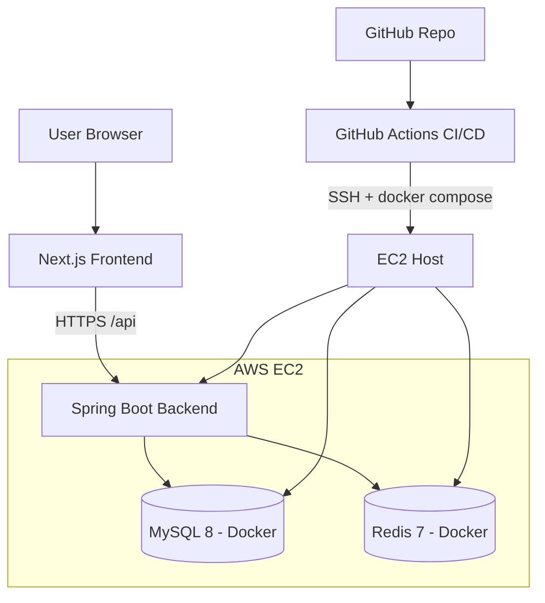
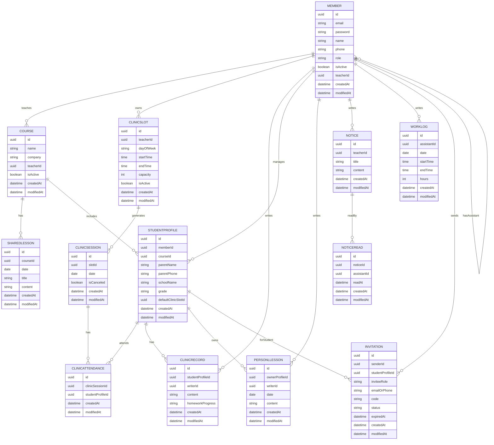

# 1.2

# 1. 프로젝트 개요

### **목표**

- 학원 강사들이 수업, 학생, 조교 일정을 통합 관리하고 커뮤니케이션을 효율화하는 플랫폼을 구축한다.

### 아키텍쳐



1. **사용자**가 Frontend(Next.js)에서 로그인
2. JWT 토큰을 발급받아 Header에 포함하여 API 요청
3. Spring Boot Backend에서 Role 기반 인가 후 처리
4. JPA를 통해 MySQL/Redis 접근
5. 필요한 경우 캐싱된 데이터를 반환하여 성능 최적화
6. Frontend에서 결과를 대시보드 형태로 렌더링

---

# 2. 도메인 구체화

## 2.1 주요 엔티티

| 엔티티 | 설명 |
| --- | --- |
| **Member** | 사용자 엔티티(Teacher, Student, SuperAdmin, Assistant) |
| Course | 반 정보(Teacher가 생성) |
| SharedLesson | 공통 진도 |
| CliicSlot | 클리닉 시간표(요일, 시간) |
| Notice | 선생님이 조교에게 전달하는 공지사항 |
| NoticeRead | 조교가 읽었는지 체크 |
| Invitation | 선생님이 조교를, 조교가 학생을 초대 |
| ClinicSession | 매주 열리는 클리닉 세션 |
| ClinicRecord | 선생님, 조교가 기록하는 클리닉 내용 |
| PersonalLesson | 학생별 개별 진도 |
| StudentProfile | 학생 상세 정보 |
| WorkLog | 조교 근무 일지  |

## 2.2 관계

| **관계** | **설명** |
| --- | --- |
| Member 1:N Course (Teacher) | 선생님은 여러 반을 관리 |
| Member 1:N Notice (Teacher) | 공지사항 작성 (조교 대상) |
| Notice 1:N NoticeRead (Assistant) | 조교가 공지사항 읽음 처리 |
| Member 1:N Invitation (Teacher, Assistant) | 초대 생성 |
| Member 1:N ClinicSlot (Teacher) | 클리닉 시간표 생성 |
| Member 1:N StudentProfile  | 선생님이 학생 상세 정보 생성 |
| Member 1:N WorkLog | 조교가 근무 일지 작성 |
| StudentProfile 1:N PersonalLesson | 학생 정보에 개별 진도내용 포함 |
| ClinicSlot 1:N ClinicSession  | 특정 날짜 실제 클리닉 세션 |
| ClinicSession 1:N ClinicAttendance  | 특정 세션 학생 목록 |
| Member 1:N ClinicAttendance (Student) | 특정 클리닉 세션에 참석하는 학생 |
| ClinicAttendance 1:1 ClinicRecord | 한명의 학생에게 한명의 기록 |
| Course 1:N SharedLesson | 반에 공통진도 작성 |

## 2.3 엔티티 규칙

### StudentProfile

1. 선생님이 학생의 대한 정보를 생성한다.
2. 조교들은 학생의 정보를 수정만 할 수 있다.

### Invitation

1. 선생님은 조교들을 초대할 수 있다.
2. 조교는 Profile 데이터를 통해 학생을 초대할 수 있다.

### WorkLog

1. 조교가 근무일지 생성, 확인, 수정, 삭제할 수 있다.
2. 선생님은 조교의 근무일지를 확인 할 수 있다.

## 2.4 엔티티 구성

### 공통 필드

- id - uuid
- createdAt - LocalDateTime
- modifiedAt - LocalDateTime

### Member

- email - string
- password -string
- name - string
- phone - string
- role - enum(TEACHER, ASSISTANT, SUPERADMIN,STUDENT)
- isActive - boolean
- teacherId (nullable, FK → Member.id)  // **assistant 전용**

### SharedLesson

- courseId - Course.id
- date - LocalDate
- title - string
- content - text

### Course

- name : string
- company : string
- teacherId : FK(Member.id)
- isActive - boolean

### StudentProfile

- memberId - nullable, FK → Member.id
- courseId (FK → Course.id)
- parentName - string
- parentPhone - string
- schoolName - string
- grade - string
- defaultClinicSlotId (nullable, Fk→ClinicSlot.id)

### PersonalLesson

- ownerProfileId (FK → StudentProfile.id)
- writerId (FK → Member.id) // Teacher
- date (LocalDate)
- content

### ClinicSlot

- teacherId (FK → Member.id)
- dayOfWeek (ENUM: MON, TUE, WED…)
- startTime (LocalTime)
- endTime (LocalTime)
- capacity (int)
- isActive (boolean)

### ClinicSession

- slotId (FK → ClinicSlot.id)
- date (LocalDate)
- isCanceled (boolean)

****

### **ClinicAttendance**

- id - PK
- clinicSessionId
- studentProfileId

### ClinicRecord

- studentProfileId (FK → StudentProfile.id)
- writerId (FK → Member.id) // Teacher or Assistant
- content
- homeworkProgress (string or ENUM)

### Notice

- teacherId (FK → Member.id)
- title
- content

### NoticeRead

- id - PK
- noticeId (FK → Notice.id)
- assistantId (FK → Member.id)
- readAt - LocalDateTime

### WorkLog

- assistantId (FK → Member.id, role = ASSISTANT)
- date - LocalDate
- startTime - LocalTime
- endTime - LocalTime
- hours - int

### Invitation

- senderId (FK → Member.id)
- studentProfileId (nullable, FK → StudentProfile.id)
- inviteeRole (ENUM: ASSISTANT, STUDENT)
- emailOrPhone
- code (unique)
- status (ENUM: PENDING, ACCEPTED, EXPIRED)
- expiredAt

## 📐 2.5 ERD



---

# 3. API 명세

## 3.1 Resource & Base Path

| **리소스** | **Base Path** | **담당 도메인 / 역할** |
| --- | --- | --- |
| **Auth** | /auth | 로그인, 로그아웃, 토큰 재발급, 초대 코드 검증 등 인증/인가 관련 |
| **Members** | /members | 사용자 기본 정보 조회/관리 (Teacher, Assistant, Student, SuperAdmin 공통) |
| **Courses** | /courses | 반(Course) 생성/수정/삭제, 반 목록/상세 조회 |
| **StudentProfiles** | /student-profiles | 학생 상세 정보(StudentProfile) CRUD, 특정 반의 학생 목록 조회 |
| **SharedLessons** | /shared-lessons | 반별 공통 진도 기록 조회/작성/수정/삭제 |
| **PersonalLessons** | /personal-lessons | 학생별 개별 진도 기록 조회/작성/수정/삭제 |
| **ClinicSlots** | /clinic-slots | 요일·시간 기준 클리닉 “시간표” 관리 (반복되는 Slot) |
| **ClinicSessions** | /clinic-sessions | 특정 날짜에 실제로 열린 클리닉 세션 관리 (Slot → Session) |
| **ClinicAttendance** | /clinic-attendances | 특정 세션에 어떤 학생들이 참석하는지(ClinicAttendance) 관리 |
| **ClinicRecords** | /clinic-records | 클리닉에서 학생별로 작성하는 기록(내용, 숙제 진도 등) |
| **Notices** | /notices | 선생님이 조교에게 보내는 공지 CRUD |
| **NoticeReads** | /notices/{noticeId}/reads | 조교가 공지를 읽었다고 체크 (서브 리소스로 두는 게 REST스럽다) |
| **WorkLogs** | /work-logs | 조교 근무 일지 CRUD |
| **Invitations** | /invitations | 선생님→조교, 조교→학생 초대 링크/코드 관리 |

## 3.2 리소스별 CRUD 기본 설계

### 1) Auth

| **Method** | **URI** | **설명** |
| --- | --- | --- |
| POST | /auth/login | 로그인 |
| POST | /auth/logout | 로그아웃 |
| POST | /auth/refresh | 토큰 재발급 |
| POST | /auth/register/teacher | 선생님 회원가입 |
| POST | /auth/register/by-invitation | 초대코드 기반 회원가입 |
| POST | /auth/verify-invitation | 초대코드 유효성 검사 |

### 2) Member

| **Method** | **URI** | **설명** |
| --- | --- | --- |
| GET | /members/me | 내 정보 조회 |
| PATCH | /members/me | 내 정보 수정 |
| GET | /members | 멤버 목록(필터: role 등) |
| GET | /members/{memberId} | 멤버 상세 조회 |
| PATCH | /members/{memberId} | 멤버 정보 수정 |
| PATCH | /members/{memberId}/deactivate | 멤버 비활성화(퇴원/퇴사) |

### 3) Course

| **Method** | **URI** | **설명** |
| --- | --- | --- |
| POST | /courses | 반 생성 |
| GET | /courses | 내가 관리하는 반 목록 |
| GET | /courses/{courseId} | 반 상세 |
| PATCH | /courses/{courseId} | 반 정보 수정 |
| PATCH | /courses/{courseId}/deactivate | 반 비활성화 |
| GET | /courses/{courseId}/students | 반의 학생 목록 |
| GET | /courses/{courseId}/shared-lessons | 반의 공통 진도 목록 |

### 4) StudentProfile

| **Method** | **URI** | **설명** |
| --- | --- | --- |
| POST | /student-profiles | 학생 프로필 생성 |
| GET | /student-profiles | 학생 프로필 목록(필터: courseId 등) |
| GET | /student-profiles/{profileId} | 학생 프로필 상세 |
| PATCH | /student-profiles/{profileId} | 학생 프로필 수정 |
| DELETE | /student-profiles/{profileId} | 학생 프로필 삭제 |
| GET | /student-profiles/{profileId}/personal-lessons | 해당 학생 개별 진도 목록 |
| GET | /student-profiles/{profileId}/clinic-records | 해당 학생 클리닉 기록 목록 |
| GET | /student-profiles/{profileId}/timeline | 캘린더 뷰용 타임라인(공통+개별+클리닉) |

### 5) SharedLesson

| **Method** | **URI** | **설명** |
| --- | --- | --- |
| POST | /shared-lessons | 공통 진도 작성 |
| GET | /shared-lessons | 공통 진도 목록(필터: courseId, 날짜) |
| GET | /shared-lessons/{lessonId} | 공통 진도 상세 |
| PATCH | /shared-lessons/{lessonId} | 공통 진도 수정 |
| DELETE | /shared-lessons/{lessonId} | 공통 진도 삭제 |

### 6) PersonalLesson

| **Method** | **URI** | **설명** |
| --- | --- | --- |
| POST | /personal-lessons | 개별 진도 작성 |
| GET | /personal-lessons | 개별 진도 목록(필터: studentProfileId 등) |
| GET | /personal-lessons/{lessonId} | 개별 진도 상세 |
| PATCH | /personal-lessons/{lessonId} | 개별 진도 수정 |
| DELETE | /personal-lessons/{lessonId} | 개별 진도 삭제 |

### 7) ClinicSlot

| **Method** | **URI** | **설명** |
| --- | --- | --- |
| POST | /clinic-slots | 클리닉 슬롯 생성(요일/시간/정원) |
| GET | /clinic-slots | 슬롯 목록(필터: teacherId 등) |
| GET | /clinic-slots/{slotId} | 슬롯 상세 |
| PATCH | /clinic-slots/{slotId} | 슬롯 수정 |
| PATCH | /clinic-slots/{slotId}/deactivate | 슬롯 비활성화 |

### 8) ClinicSession

| **Method** | **URI** | **설명** |
| --- | --- | --- |
| **GET** | /clinic-sessions | 세션 목록 조회 (필터: date range, slotId, teacherId 등) |
| **GET** | /clinic-sessions/{sessionId} | 특정 세션 상세 조회 |
| **PATCH** | /clinic-sessions/{sessionId} | 세션 수정(취소 isCanceled, 시간 변경 등 예외적 상황) |
| **DELETE** | /clinic-sessions/{sessionId} | 세션 삭제(예외 상황 시) |
| **POST** | /clinic-slots/{slotId}/sessions | 특정 Slot 기반 “단일 날짜” 세션 수동 생성 |
| **POST** | /clinic-sessions/generate-weekly | 모든 활성 Slot을 기반으로 해당 주의 세션 일괄 생성(자동 생성용 API) |

### 9) **ClinicAttendance**

| **Method** | **URI** | **설명** |
| --- | --- | --- |
| GET | /clinic-sessions/{sessionId}/attendances | 해당 세션 참석 학생 목록 |
| POST | /clinic-sessions/{sessionId}/attendances | 세션에 학생 추가(예약/배정) |
| DELETE | /clinic-sessions/{sessionId}/attendances/{attendanceId} | 세션에서 학생 제거 |

### 10) ClinicRecord

| **Method** | **URI** | **설명** |
| --- | --- | --- |
| POST | /clinic-records | 클리닉 기록 작성(출석 처리 포함) |
| GET | /clinic-records | 기록 목록(필터: sessionId, studentProfileId, 날짜) |
| GET | /clinic-records/{recordId} | 기록 상세 |
| PATCH | /clinic-records/{recordId} | 기록 수정 |
| DELETE | /clinic-records/{recordId} | 기록 삭제 |

### 11) Notice

| **Method** | **URI** | **설명** |
| --- | --- | --- |
| POST | /notices | 공지 작성 |
| GET | /notices | 공지 목록(필터: teacherId 등) |
| GET | /notices/{noticeId} | 공지 상세 |
| PATCH | /notices/{noticeId} | 공지 수정 |
| DELETE | /notices/{noticeId} | 공지 삭제 |

### 12) NoticeRead

| **Method** | **URI** | **설명** |
| --- | --- | --- |
| POST | /notices/{noticeId}/reads | 현재 로그인 조교 읽음 처리 |
| GET | /notices/{noticeId}/reads | 읽은 조교 목록 조회 |

### 13) WorkLog

| **Method** | **URI** | **설명** |
| --- | --- | --- |
| POST | /work-logs | 근무 일지 작성 |
| GET | /work-logs | 근무 일지 목록(필터: assistantId, 날짜 등) |
| GET | /work-logs/{workLogId} | 근무 일지 상세 |
| PATCH | /work-logs/{workLogId} | 근무 일지 수정 |
| DELETE | /work-logs/{workLogId} | 근무 일지 삭제 |
| GET | /members/me/work-logs | 내 근무 일지 목록(조교용) |

### 14) Invitation

| **Method** | **URI** | **설명** |
| --- | --- | --- |
| POST | /invitations | 초대 생성(선생님→조교, 조교→학생) |
| GET | /invitations | 내가 보낸 초대 목록 |
| GET | /invitations/{invitationId} | 초대 상세 |
| DELETE | /invitations/{invitationId} | 초대 취소 |
| GET | /invitations/code/{code} | 코드로 초대 조회(회원가입 진입용) |
| POST | /auth/verify-invitation | 초대 코드 검증 |
| POST | /auth/register/by-invitation | 초대 기반 회원가입 |

## 3.3 Request, Response 정의

### 0) 공통 응답

```json
{
  "code": "string",
  "message": "string",
  "data": { } // null 가능
}
```

---

### 1) 로그인

- Request

```json
{
  "email": "string",
  "password": "string"
}
```

- Response (`data`)

```json
{
  "memberId": "uuid",
  "name": "string",
  "role": "TEACHER",        // or ASSISTANT, STUDENT, SUPERADMIN
  "accessToken": "string",
  "refreshToken": "string"
}
```

---

### 2) 로그아웃

- Request

```json
{  "refreshToken": "string"}
```

- Response (`data`)

```json
null
```

---

### 3) 토큰 재발급

- Request

```json
{  "refreshToken": "string"}
```

- Response (`data`)

```json
{  "accessToken": "string"}
```

---

### 4) 선생님 회원가입

- Request

```json
{
  "email": "string",
  "password": "string",
  "name": "string",
  "phone": "string"
}
```

- Response (`data`)

```json
{
  "memberId": "uuid",
  "email": "string",
  "name": "string",
  "phone": "string",
  "role": "TEACHER"
}
```

---

### 5) 초대코드 유효성 검사

- Request

```json
{  "code": "string"}
```

- Response (`data`)

```json
{
  "code": "string",
  "inviteeRole": "ASSISTANT",      // or STUDENT
  "status": "PENDING",             // or EXPIRED
  "studentProfileId": "uuid",      // STUDENT 초대일 때만 (nullable)
  "teacherId": "uuid"              // 초대한 선생님
}
```

---